  

  

## 📌 About Me
- 🔭 I am a student in the **Informatics** major at **Sultan Ageng Tirtayasa University**, **Indonesia**
- 🌱 I’m currently learning HTML, CSS, and JavaScript. I focus on writing clean, maintainable code and delivering user-centric solutions that ensure projects stand out.

## 🧠 My Focus Areas
- Web Development

## 📊 GitHub Stats & Trophies

  
  

  

  

  

## 🛠️ Languages & Tools

<h3 align="center">Programming Languages</h3>

  

<h3 align="center">Frontend</h3>

  &nbsp;&nbsp;
  

<h3 align="center">Tools</h3>

  &nbsp;&nbsp;
  

  

 

## 🔗 Connect with Me

  &nbsp;&nbsp;
  

  

  

